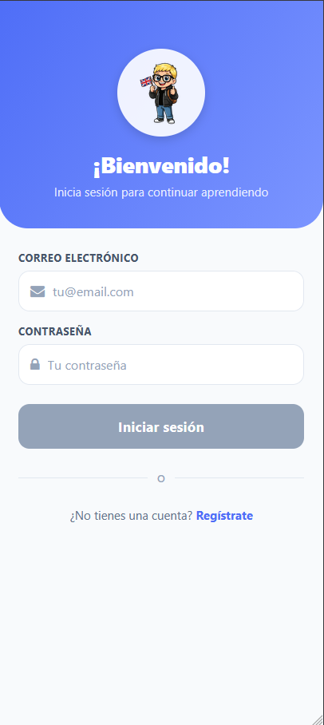
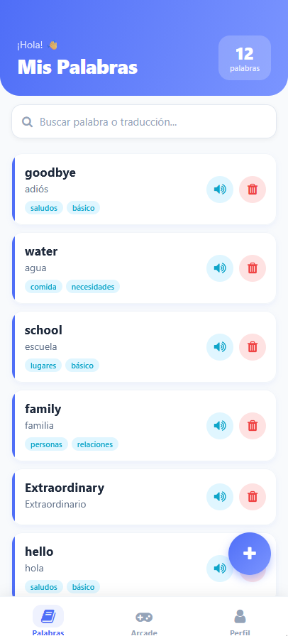
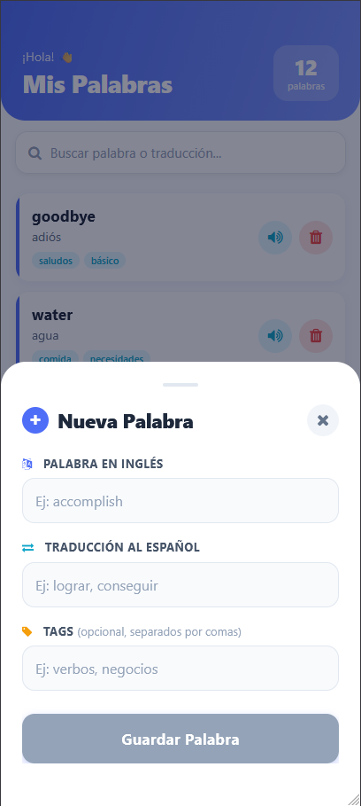
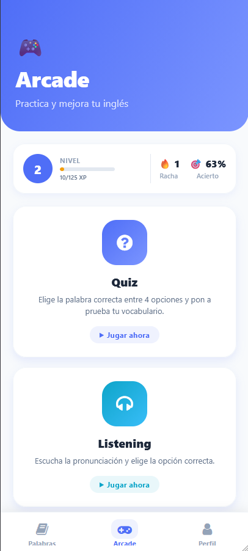
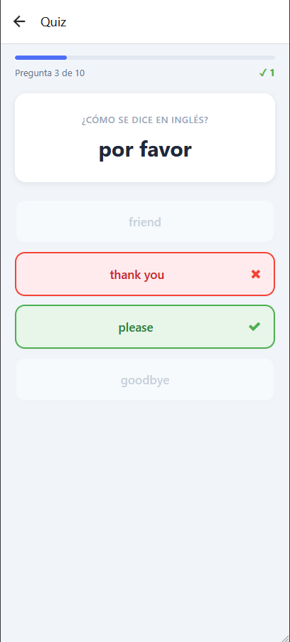
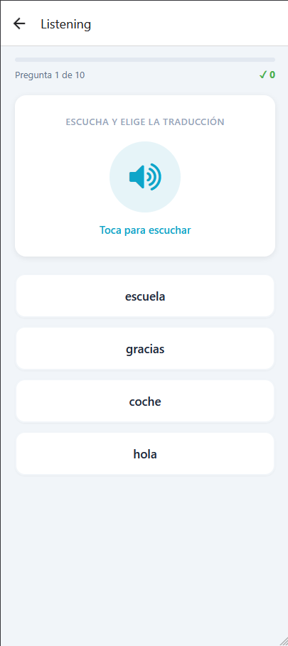
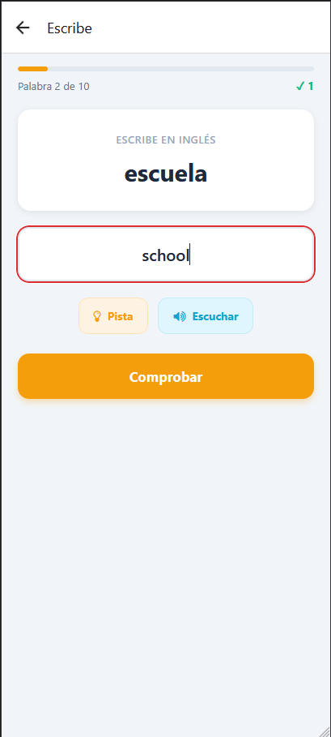
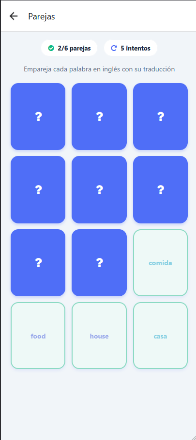
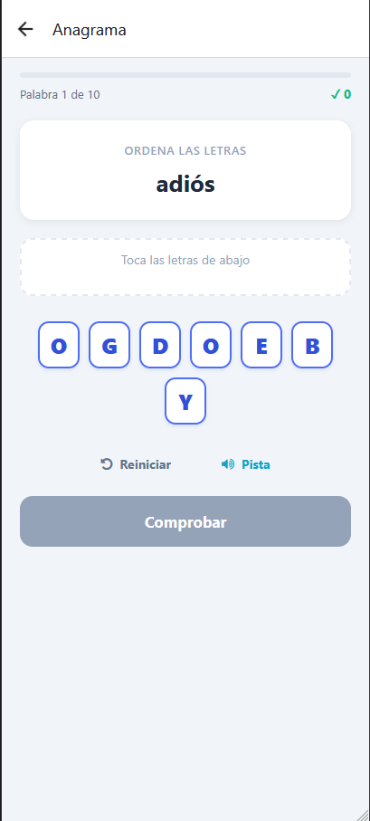

<div align="center">


# EnglishWithAlex

**Tu vocabulario de inglés, a tu manera — guárdalo, escúchalo y apréndelo jugando.**

[](https://expo.dev)
[](https://reactnative.dev)
[](https://www.typescriptlang.org)
[](https://firebase.google.com)
[](https://clerk.com)

[Español](#-español) · [English](#-english-summary)

</div>

---

## 🇪🇸 Español

**EnglishWithAlex** es una aplicación móvil (Android, iOS y Web) para aprender vocabulario en
inglés. Cada usuario crea su propio diccionario personal de palabras con su traducción,
escucha la pronunciación y refuerza lo aprendido con un **Arcade de 5 minijuegos** y un
sistema de **progreso y rachas** que motiva a practicar cada día.

### ✨ Características

#### 📚 Mis Palabras
- Diccionario personal: añade palabras con su **traducción** y **etiquetas** (tags) opcionales.
- **Pronunciación** de cada palabra con Text-to-Speech (acento británico).
- **Búsqueda** instantánea por palabra, traducción o etiqueta.
- Eliminar palabras con confirmación.
- Sincronización en la nube: tus palabras te siguen en cualquier dispositivo.

#### 🎮 Arcade — 5 minijuegos
Todos los juegos se generan automáticamente a partir de **tus** palabras guardadas:

| Juego | Descripción | Habilidad que entrena |
| ----- | ----------- | --------------------- |
| **Quiz** | Elige la palabra en inglés correcta entre 4 opciones. | Reconocimiento de vocabulario |
| **Listening** | Escucha la pronunciación y elige la traducción correcta. | Comprensión auditiva |
| **Escribe** | Lee la traducción y escribe la palabra en inglés (con pista y audio). | Recuerdo activo + ortografía |
| **Parejas** | Empareja cada palabra con su traducción en el menor número de intentos. | Asociación y memoria |
| **Anagrama** | Ordena las letras desordenadas para formar la palabra. | Construcción de palabras |

#### 🏆 Progreso y gamificación
- **Nivel y XP**: ganas experiencia con cada acierto y subes de nivel.
- **Racha diaria 🔥**: días consecutivos jugando.
- **Estadísticas**: partidas jugadas, precisión global, mejor racha de aciertos y aciertos totales.
- Panel de progreso en el **Perfil** y resumen rápido en el **Arcade**.

#### 🔐 Cuentas de usuario
- Registro e inicio de sesión con **Clerk** (email/contraseña y Google).
- Cada usuario tiene sus propias palabras y estadísticas privadas.

### 📸 Capturas


<div align="center">

| Inicio de sesión | Mis Palabras | Añadir palabra |
| :--------------: | :----------: | :------------: |
|  |  |  |

| Arcade + Progreso | Perfil | Quiz |
| :---------------: | :----: | :--: |
|  |  |  |

| Listening | Escribe | Parejas | Anagrama |
| :-------: | :-----: | :-----: | :------: |
|  |  |  |  |

</div>

### 🛠️ Tecnologías

| Categoría | Tecnología |
| --------- | ---------- |
| Framework | [Expo](https://expo.dev) (SDK 54) + [React Native](https://reactnative.dev) 0.81 |
| Lenguaje | [TypeScript](https://www.typescriptlang.org) |
| Navegación | [Expo Router](https://docs.expo.dev/router/introduction) (file-based, typed routes) |
| Autenticación | [Clerk](https://clerk.com) (`@clerk/clerk-expo`) |
| Base de datos | [Firebase Firestore](https://firebase.google.com/docs/firestore) |
| Voz / TTS | [`expo-speech`](https://docs.expo.dev/versions/latest/sdk/speech/) |
| UI / Estilos | `StyleSheet`, [`expo-linear-gradient`](https://docs.expo.dev/versions/latest/sdk/linear-gradient/), animaciones con `Animated` y [Reanimated](https://docs.swmansion.com/react-native-reanimated/) |
| Iconos | [`@expo/vector-icons`](https://icons.expo.fyi) (FontAwesome) |
| Almacenamiento seguro | [`expo-secure-store`](https://docs.expo.dev/versions/latest/sdk/securestore/) (token cache de Clerk) |
| Plataformas | Android · iOS · Web (`react-native-web`) |

### 🧱 Estructura del proyecto

```
EnglishWithAlex/
├── app/                      # Rutas (Expo Router, file-based routing)
│   ├── _layout.tsx           # Layout raíz: ClerkProvider + Stack
│   ├── (home)/               # Redirección según sesión (tabs o sign-in)
│   ├── (auth)/               # sign-in / sign-up
│   ├── (tabs)/               # Navegación principal
│   │   ├── index.tsx         #   📚 Mis Palabras
│   │   ├── arcade.tsx        #   🎮 Arcade (lista de juegos + progreso)
│   │   └── profile.tsx       #   👤 Perfil (estadísticas)
│   ├── (games)/              # Pantallas de cada minijuego
│   │   ├── quiz.tsx
│   │   ├── listening.tsx
│   │   ├── spelling.tsx      #   Escribe
│   │   ├── memory.tsx        #   Parejas
│   │   └── scramble.tsx      #   Anagrama
│   └── components/           # WordCard, GameCard, SearchBar, AddWordModal
├── services/
│   ├── wordService.ts        # CRUD de palabras en Firestore
│   └── statsService.ts       # XP, niveles, rachas y resultados de partidas
├── config/
│   └── firebase.ts           # Inicialización de Firebase
├── constants/
│   └── colors.ts             # Paleta de colores
├── assets/images/            # Logos, ilustraciones de Alex, iconos
└── docs/screenshots/         # Capturas para este README
```

### 🗄️ Modelo de datos (Firestore)

```
users/{userId}
├── email: string
├── createdAt: timestamp
├── stats: {                         # Progreso del usuario
│     gamesPlayed, totalCorrect, totalQuestions,
│     bestStreak, dayStreak, lastPlayedDate, xp
│   }
└── words/{wordId}                    # Subcolección de palabras
      ├── word: string                #   palabra en inglés
      ├── translation: string         #   traducción
      ├── tags: string[]              #   etiquetas
      └── createdAt: timestamp
```

### 🚀 Puesta en marcha

#### Requisitos previos
- [Node.js](https://nodejs.org) 18 o superior
- `npm` (incluido con Node)
- App **Expo Go** en tu móvil, o un emulador de Android / simulador de iOS
- Un proyecto de **Firebase** (con Firestore activado) y una cuenta de **Clerk**

#### 1. Clonar e instalar
```bash
git clone https://github.com/<tu-usuario>/EnglishWithAlex.git
cd EnglishWithAlex
npm install
```

#### 2. Variables de entorno
Crea un archivo **`.env`** en la raíz del proyecto con tus claves:

```env
# Clerk
EXPO_PUBLIC_CLERK_PUBLISHABLE_KEY=pk_test_xxxxxxxx

# Firebase
EXPO_PUBLIC_FIREBASE_API_KEY=xxxxxxxx
EXPO_PUBLIC_FIREBASE_AUTH_DOMAIN=tu-proyecto.firebaseapp.com
EXPO_PUBLIC_FIREBASE_PROJECT_ID=tu-proyecto
EXPO_PUBLIC_FIREBASE_STORAGE_BUCKET=tu-proyecto.appspot.com
EXPO_PUBLIC_FIREBASE_MESSAGING_SENDER_ID=xxxxxxxx
EXPO_PUBLIC_FIREBASE_APP_ID=xxxxxxxx
```

> Las variables deben empezar por `EXPO_PUBLIC_` para que Expo las exponga en el cliente.

#### 3. Ejecutar
```bash
npx expo start          # menú interactivo (Android / iOS / Web)
# o directamente:
npm run android
npm run ios
npm run web
```

### 📜 Scripts disponibles

| Script | Acción |
| ------ | ------ |
| `npm start` | Inicia el servidor de desarrollo de Expo |
| `npm run android` | Compila y abre en Android |
| `npm run ios` | Compila y abre en iOS |
| `npm run web` | Abre la versión web |
| `npm run lint` | Ejecuta ESLint |

### 🎯 Cómo se usa

1. **Regístrate** o inicia sesión.
2. En **Mis Palabras**, pulsa el botón **+** para añadir palabras con su traducción y etiquetas.
3. Toca el icono 🔊 para **escuchar** la pronunciación.
4. Ve al **Arcade** y elige un juego (necesitas al menos 4 palabras guardadas).
5. Acumula **XP**, sube de **nivel** y mantén tu **racha diaria** 🔥.
6. Consulta tu evolución en el **Perfil**.

---

## 🇬🇧 English summary

**EnglishWithAlex** is a cross-platform mobile app (Android, iOS & Web) for learning English
vocabulary. Each user builds a personal dictionary of words with translations and tags, hears
their pronunciation (text-to-speech), and practises through an **Arcade of 5 mini-games** —
**Quiz, Listening, Spelling (Escribe), Memory (Parejas) and Scramble (Anagrama)** — all
generated automatically from the user's own saved words.

A built-in **gamification system** rewards practice with **XP, levels, daily streaks 🔥** and
**accuracy stats**, shown on the Profile and Arcade screens.

**Tech stack:** Expo (SDK 54) · React Native 0.81 · TypeScript · Expo Router · Clerk (auth) ·
Firebase Firestore · expo-speech · expo-linear-gradient · Reanimated.

**Getting started:** `npm install`, create a `.env` file with your Clerk + Firebase keys
(see the Spanish section above), then run `npx expo start`.

---

<div align="center">

Desarrollado por **Unai Guerra Matas**

</div>
